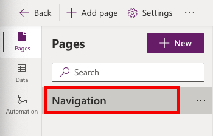
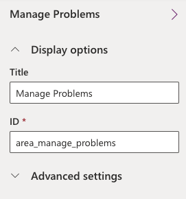

---
lab:
    title: 'Lab 02.3: Compose your model-driven app'
    module: 'Module 02: Get started using Dataverse'
---

In this lab you will be model-driven app that will be used for tracking problems
and managing the overall effort.

## What you will learn

-   Build as model-driven application

## High-level lab steps

-   Exercise 1 – Compose a basic model-driven app

## Detailed steps

### Exercise 1: Compose model-driven application

In this exercise, you will create a model-driven application.

#### Task 1: Create new model-driven application

1.  Navigate to the [Power Apps maker portal](https://make.powerapps.com/) and make sure you are in the correct environment.

2.  Select **Solutions** and open the **Company 311** solution.

3.  Select **+ New > App > Model-driven app** from the command bar.

    

4.  Enter `Company 311 Admin` for name and select **Create**. 

    

5.  Select **Navigation** from the left menu. 

    

6.  In the properties pane, check **Enable Areas**. 

7.  Select **Area1**. Select the ellipses on the right of **Area1** and select **Edit properties**. 

    

8.  Go to the **Properties** pane, enter `Manage Problems` for **Title**, and enter `area_manage_problems` for **ID**.

    

9.  Select **+ Add page** on the **Pages** menu.

10. Select **Next**.

11. Search for and select **Problem Report**.

12. Select **Add**.

    
    
13. Select **New Group** in the navigation pane.

14. Go to the **Properties**, enter `Problems` for **Title**, and enter `group_problems` for **ID**.

15. Select the area selector and then select **New area**.
    
    

16. Go to the **Properties** pane, enter `Settings` for **Title**, and enter `area_settings` for **ID**.

    
    
17. Select **+ New** on the **Pages** menu.

18. Select **Next**.

19. Search for and select **Building**.

20. Search for and select **Department**.

21. Select **Add**

22. Select **New Group**.

23. Go to the **Properties** pane, enter `Taxonomy` for **Title**, and enter `group_taxonomy` for **ID**.

24. The navigation should now look like the image below. Select **Save**.

    

25. Select **Publish** to publish the sitemap and wait for the publishing to complete.

26. Select the **🡠 Back** button to return to the **Solution Explorer**.

27. Select **All** in the **Objects** navigation tree.

28. Select **Publish all customizations** and wait for the publishing to complete.

    


### Exercise 5: Input data

In this exercise, you will input data to the Dataverse tables.

#### Task 1: Input data

1.  Navigate to the [Power Apps maker portal](https://make.powerapps.com/) and make sure you are in the correct environment.

2.  Select **Apps** and play the **Company 311 Admin** application created in the previous exercise.

    

3.  Select **Change area**.

    

4.  Select the **Settings** area.

5.  Select **Departments** and select **+ New**.

    

6.  Enter `Information Technology` for **Name** and select **Save**.

    

7.  Select **Buildings**.

    

8.  Select **+ New**.

9.  Enter `San Francisco Main Campus` for **Name** and select **Save & Close**.

10. Select **+ New** again.

11. Enter `London Paddington` for **Name** and select **Save & Close**.

    You should now have two Building rows.

12. Select **Change area**.

    

13. Select **Manage Problems**.

14. Select **+ New**.

    

15. Enter **Broken door** for **Title**, select **San Francisco Main Campus** for **Building**, enter **The main entrance door will not open all the way** for **Details**, and select **Save**.

    > **NOTE**
    >
    > You cannot save images before creating the row in the database. Select **Save** and then you may upload a picture.

    

16. Select **Open file** on the **Photo** field.

    

17. Select an image from your device. The sample image displayed below can be found [here](https://github.com/MicrosoftLearning/PL-100-Microsoft-Power-Platform-App-Maker/blob/master/Instructions/Labs/02-1/Resources/door.png?raw=true).

18. The image should now show on the form.

    

19. Select **Save & Close**.


### Exercise 6: Import data

In this exercise, you will import sample data into the environment. Rows are imported by a Power Automate cloud flow that you will first import using a solution.

#### Task 1: Import solution

1.  Navigate to the [Power Apps maker portal](https://make.powerapps.com/) and make sure you are in the correct environment.

2.  Select **Solutions** and select  **Import Solution**.

3.  Select **Browse**.

4.  Select the **DataImport.zip** solution file located in the Lab Resources folder and select **Open**.

    > **TIP** 
    > 
    > The solution file can be found here: ```F:\Instructions\Labs\02-1\Resources\DataImport.zip```

5.  Select **Next**.

6.  Select **Next** again.

7.  Expand the **Select a connection** dropdown and select **+ New connection**.

8.  A new tab will open with a prompt to create the **Microsoft Dataverse** connection. 

9.  Select **Create**, authenticate if required, wait until new connection is created. **Close** the browser tab.

10. Select **Refresh**. Verify the new connection is selected in the drop-down. 

11. Select **Import** and wait for the message **Solution "Data Import" imported successfully** to appear.

12. Select **Publish all customizations** and wait for the publishing to complete. 


#### Task 2: Review and run flow

1.  Open the **Data Import** solution you imported.

2.  Select the **Import Data** flow. 

    

3.  Select **Edit** from the Command Bar.
 
5.  If necessary, dismiss the welcome prompt by selecting **Get started**.

6.  Expand the **InputData** step.

7.  Review the JSON text in the **Value** field. This is the data that will be imported into your environment. Note: The image data is encoded as Base-64 text.

8.  Expand the **EachDepartment** for each control.

9.  Expand and review the **Upsert Department** step.

10. Expand and review the rest of the steps.

11. Select **Save** to save the flow.

12. Select the **🡠** back button to go back to the previous page.

    

13. Open the **Import Data** flow **Details** and select **Run**.

    > **TIP**
    >
    > If the **Run** option is disabled then make sure the flow has been enabled by selecting **Turn on**.

14. Select **Run flow**.

15. Select **Done**.

16. Wait for the flow run to complete. Select the **Refresh Flow runs** button to check if the flow run completes successfully.

    

17. Close the flow editor browser window or tab.

18. Select **Done** on the popup, if prompted.


#### Task 3: Review imported data

1.  Navigate to the [Power Apps maker portal](https://make.powerapps.com/) and make sure you are in the correct environment.

2.  Select **Apps** and open the **Company 311 Admin** model-driven application.

3.  Select **Problem Reports**. You should see new rows of data.

    

    > **NOTE**
    >
    > Because the input status reason is picked randomly, some of the imported problem report rows may have the status reason of Completed, Won't Fix, or Inactive. Select the **Resolved Problems** view to find these rows.

4.  Open one of the **Problem Report** Rows.

5.  Select the **Search** icon of the **Building** lookup and make sure building Rows were imported.

    

6.  Scroll down and select the **Department** lookup.

7.  Make sure the department Rows got imported.


### **Bonus exercise**

  - Deal with problem report assignment within a department.
