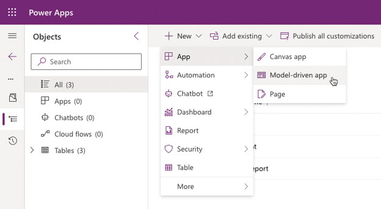
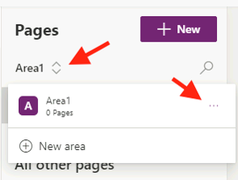
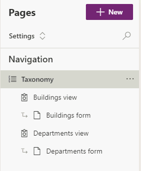

---
lab:
    title: 'Lab 04.2: Compose a model-driven app'
    module: 'Module 04: Create model-driven app'
---
# Lab 04.2: Compose a model-driven app

In this lab you will be model-driven app that will be used for tracking problems
and managing the overall effort.

## What you will learn

-   Build as model-driven application

## High-level lab steps

-   Exercise 1 – Compose a basic model-driven app

## Detailed steps

### Exercise 1: Compose model-driven application

In this exercise, you will create a model-driven application.

#### Task 1: Create new model-driven application

1.  Navigate to the [Power Apps maker portal](https://make.powerapps.com/) and make sure you are in the correct environment.

2.  Select **Solutions** and open the **Company 311** solution.

3.  Select **+ New > App > Model-driven app** from the command bar.

     

4.  Enter `Company 311 Admin` for **Name** and select **Create**. 

5.  Select **Navigation** from the left menu. 

6.  In the properties pane, check **Enable Areas**. 

7.  Select **Area1**. Select the ellipses on the right of **Area1** and select **Edit properties**. 

    

8.  Go to the **Properties** pane, enter `Manage Problems` for **Title**, and enter `area_manage_problems` for **ID**.

9.  Select **+ Add page** on the **Pages** menu.

10. Select **Dataverse Table** and select **Next**.

11. Search for and select **Problem Report**.

12. Select **Add**.
    
13. Select **New Group** in the navigation pane.

14. Go to the **Properties**, enter `Problems` for **Title**, and enter `group_problems` for **ID**.

15. Select the area selector and then select **New area**.

16. Go to the **Properties** pane, enter `Settings` for **Title**, and enter `area_settings` for **ID**.
    
17. Select **+ New** on the **Pages** menu.

18. Select **Next**.

19. Search for and select **Building**.

20. Search for and select **Department**.

21. Select **Add**

22. Select **New Group**.

23. Go to the **Properties** pane, enter `Taxonomy` for **Title**, and enter `group_taxonomy` for **ID**.

24. The navigation should now look like the image below. Select **Save**.

    

25. Select **Publish** to publish the sitemap and wait for the publishing to complete.

26. Select the **🡠 Back** button to return to the **Solution Explorer**.

27. Select **All** in the **Objects** navigation tree.

28. Select **Publish all customizations** and wait for the publishing to complete.
