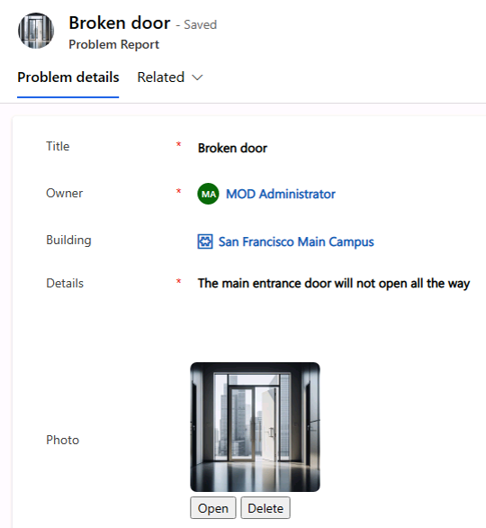
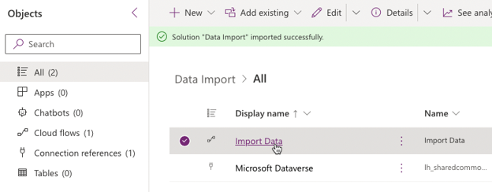
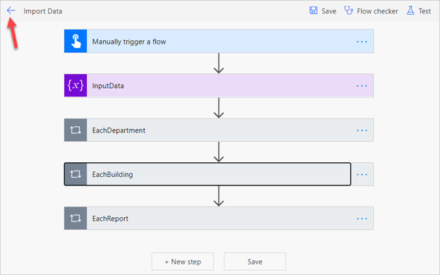
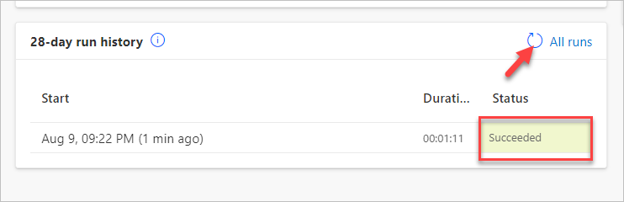
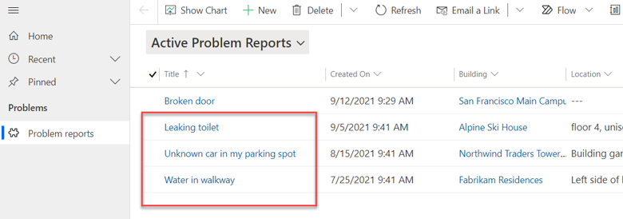
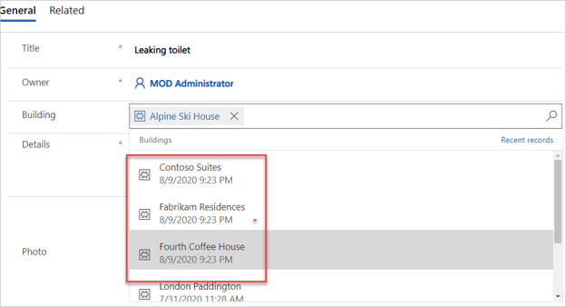

---
lab:
    title: 'Lab 04.3: Import data'
    module: 'Module 04: Create model-driven app'
---

# Lab 04.3: Import data

In this lab you will be inputting data into your Dataverse tables, refining some views, and importing data using a Power Automate flow.

## What you will learn

-   Import data and refine views
-   Import solutions

## High-level lab steps

-   Input data and refine views
-   Import Problem Report rows using a Power Automate flow

## Detailed steps

### Exercise 1: Input data

In this exercise, you will input data to the Dataverse tables.

#### Task 1: Input data

1.  Navigate to `https://make.powerapps.com` and make sure you are in the correct environment.

2.  Select **Apps** and play the **Company 311 Admin** application created in
    the previous exercise.

3.  Select Manage Problems at the bottom left and change the area to **Settings**.

4.  Using the navigation on the left, choose **Departments** and select the **+ New** button.

5.  Enter `Information Technology` for **Name** and select **Save**.

6.  Select **Buildings** under the **Taxonomy** group.

7.  Select **+ New**.

8.  Enter `San Francisco Main Campus` for **Name** and select **Save & Close**.

9.  Select **+ New** again.

10. Enter `London Paddington` for **Name** and select **Save & Close**. You should now have two Building rows.

    

11. Use the area selector to navigate from Settings to **Manage Problems**.

12. Select **+ New**.

13. Enter `Broken door` for **Title**, select **San Francisco Main Campus** for **Building**, enter `The main entrance door will not open all the way` for **Details**, and select **Save**.

    > **NOTE**
    >
    > You cannot save images before creating the row in the database. Select **Save** and then you may upload a picture.

14. Select **Open file** on the **Photo** field.

15. Select an image from your device. The sample image displayed below can be found [here](https://github.com/MicrosoftLearning/PL-100-Microsoft-Power-Platform-App-Maker/blob/master/Instructions/Labs/02-4\Resources\door.png?raw=true).

16. The image should now display on the form.

    

17. Select **Save & Close**.

### Exercise 2: Import data

In this exercise, you will import sample data into the environment. Rows are imported by a Power Automate cloud flow that you will first import using a solution.

#### Task 1: Import solution

1.  Navigate to the [Power Apps maker portal](https://make.powerapps.com/) and make sure you are in the correct environment.

2.  Select **Solutions** and select  **Import Solution**.

3.  Select **Browse**.

4.  Select the **DataImport.zip** solution file located in the Lab Resources folder and select **Open**.

    > **TIP** 
    > 
    > The solution file can be found here: ```F:\Instructions\Labs\02-4\Resources\DataImport.zip```

5.  Select **Next**.

6.  Select **Next** again.

7.  Expand the **Select a connection** dropdown and select **+ New connection**.

8.  A new tab will open with a prompt to create the **Microsoft Dataverse** connection. 

9.  Select **Create**, authenticate if required, ad wait until new connection is created. **Close** the browser tab.

10. Select **Refresh**. Verify the new connection is selected in the drop-down. 

11. Select **Import** and wait for the message 'Solution "Data Import" imported successfully' to appear.

12. Select **Publish all customizations** and wait for the publishing to complete. 


#### Task 2: Review and run flow

1.  Open the **Data Import** solution you imported.

2.  Select the **Import Data** flow. 

    

3.  Select **Edit** from the Command Bar.
 
4.  If necessary, dismiss the welcome prompt by selecting **Get started**.

5.  Expand the **InputData** step.

6.  Review the JSON text in the **Value** field. This is the data that will be imported into your environment. Note: The image data is encoded as Base-64 text.

7.  Expand the **EachDepartment** for each control.

8.  Expand and review the **Upsert Department** step.

9. Expand and review the rest of the steps.

10. Select **Save** to save the flow.

11. Select the **🡠** back button to go back to the previous page.

    

12. Open the **Import Data** flow details page again and select **Run**.

    > **TIP**
    >
    > If the **Run** option is disabled, make sure the flow has been enabled by selecting **Turn on**.

13. Select **Run flow**.

14. Select **Done**.

15. Wait for the flow run to complete. Select the **Refresh Flow runs** button to check if the flow run completes successfully.

    


#### Task 3: Review imported data

1.  Navigate to the [Power Apps maker portal](https://make.powerapps.com/) and make sure you are in the correct environment.

2.  Select **Apps** and play the **Company 311 Admin** model-driven application.

3.  The app should open with the Active Problem Reports view. You should see new rows of data.

     

    > **NOTE**
    >
    > Because the input status reason is picked randomly, some of the imported problem report rows may have the status reason of Completed, Won't Fix, or Inactive. Select the **Resolved Problems** view to find these rows.

4.  Open one of the **Problem Report** Rows.

5.  Select the **Search** icon of the **Building** lookup and verify that building rows were imported.

    

6.  Scroll down and select the **Department** lookup.

7.  Make sure the Department rows got imported.
