---
lab:
    title: 'Lab 05.1: Build canvas apps'
    module: 'Module 05: Create a canvas app'
---

# Lab 05.1: Build canvas apps

In this module you will design and build a canvas app for the company employees to submit problem reports.

## What you will learn

  - Import and use a pre-built component library
  - Create a Power Apps canvas app
  - Connect to a data source
  - Filter data
  - Create data rows
  - Use images with data rows
  - Create a canvas app from an image

## High-level lab steps

  - Import company components
  - Create app and layout main screen (including list of my items)
  - Submit New Report
  - Test
  - Create a canvas app from an image

## Prerequisites

* Must have completed **Lab 02.1: Data model**

## Detailed steps

### Exercise 1: Create canvas application

In this exercise, you will import a solution with shared components, create a view for the Problem Report table and create a canvas application.

#### Task 1: Import component library solution

In this task, you will import the shared components solution into your environment. This shared component library was built by another team at your company.

1.  Navigate to the [Power Apps maker portal](https://make.powerapps.com/) page and make sure you are in the correct environment.

2.  Select **Solutions** and select **Import solution**.

3.  Select **Browse**.

4.  Go to the Lab Resources folder, select the **Shared Components** solution file, and select **Open**. You may also download the file to your computer [here](https://github.com/MicrosoftLearning/PL-100-Microsoft-Power-Platform-App-Maker/raw/jan2024update/Instructions/Labs/03/Resources/SharedComponents_1_0_0_4.zip). 

    > **TIP**
    > 
    > The lab resources can be found here: `D:\Instructions\Labs\03\Resources\SharedComponents_1_0_0_4.zip`

5.  Select **Next**.

6.  Select **Import** and wait for the import to complete.

7.  Select **Publish all customizations** and wait for the publishing to complete.

8.  Open the **Shared Components** solution.

9.  The solution should have one item in it: **Lamna Healthcare Shared Components**

    > **IMPORTANT**
    >
    > There is an issue where importing the app as part of a solution may not add it to your components library. The following steps are designed to resolve the issue.

10. Navigate to the [Power Apps maker portal](https://make.powerapps.com/) page and make sure you are in the correct environment.    

11. Select **Apps** and select the **Lamna Healthcare Shared Components App** to edit the app.

13. If prompted, select your **Region/Country** and select **Get started** or select **Skip**.
    
    > **NOTE**
    >
    > When the app is open in Edit mode, move on to next step, as the Preloader component shows a Loading icon but it is not actually waiting for something to load.

14. After the app opens, select the drop-down &#709; next to the **Save** button and select **Save as**.

15. Change app name to `Lamna Healthcare Shared Components A` and select **Save**.

16. Select **OK** when prompted to save as a new library.

17. Close the **Lamna Healthcare Shared Components** tab in your browser.


#### Task 2: Create view

In this task, create a view that will show the current user’s problem reports. Later, this view will be used with the filter function in the canvas app.

1.  Navigate to the [Power Apps maker portal](https://make.powerapps.com/) page and make sure you are in the correct environment.

2.  Select **Solutions** and open the **Company 311** solution.

3.  Locate and open the **Problem Report** table.

4.  Select **Views** in the tree view in the **Objects** pane and open the **Active Problem Reports** view.

    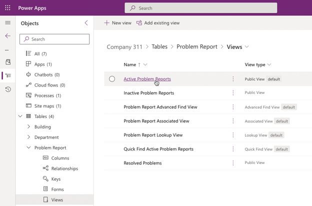

5.  Select **Edit filters**.

6.  Change the filter to **Created By, Equals current user** and select **Ok**.

7.  Select **Save As**.

8.  Enter `My Reports` for **Name** and select **Save**.

9.  Select **Save and publish** and wait for the publishing to complete.

10. Select the **🡠 Back** button on the command bar to go back to the Problem Report table details.


#### Task 3: Create the user application

In this task, create a canvas app using the phone form factor.

1.  Navigate to the [Power Apps maker portal](https://make.powerapps.com/) page and make sure you are in the correct environment.

2.  Select **Solutions** and open the **Company 311** solution.

3.  Select **+ New** > **App** > **Canvas app**.

4.  Enter `Company 311 Phone App` for **App name**, select **Phone** for format, and select **Create**.

5.  Select **Skip**.

6.  In the **Tree view**, select the three dots menu for **Screen1** and select **Rename**.

7.  Rename the screen to `Main Screen`

    It’s always a good idea to give screens a meaningful name.

8.  Select the **Main Screen** and then select **+ Insert** from the left navigation pane.

9.  Select **Get more components**.

10. Expand the **Lamna Healthcare Shared Components A** Library, select **Header** and **Tab Control**, and then select **Import**.

    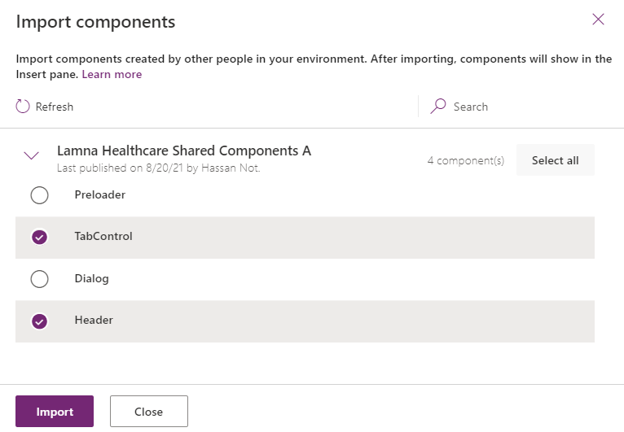

11. Expand **Library components**, select **Header** and **Tab Control**. These are both components from the library you imported earlier in the lab.

    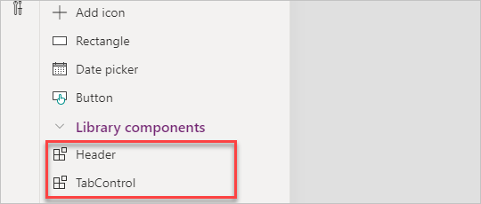

12. Move the **Tab Control** to the bottom of the screen and the **Header Control** to the top of the screen.

13. Select the **Header Control** and change the **Text** value to `Company 311`.

    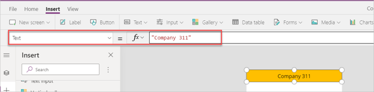

14. Set the **Height** of the **Header Control** to `75`

15. In the **Tree view**, right-click on the Main Screen and select **Duplicate screen**.

    

16. Rename the new screen `New Reports Screen`

17. Select the **Tree view**, select **App** and change the **OnStart** value to the formula below. This formula will create a new variable named My Tabs and set it to a table of tab items.

    ```javascript
    Set('My Tabs', Table( {
    	Label: "My Reports",
    	Screen: 'Main Screen',
    	Icon: "",
    	SelectedIcon:""
    },
    {
    	Label: "New Report",
    	Screen: 'New Reports Screen',
    	Icon: "",
    	SelectedIcon:""
    }
    ))
    ```

    > **IMPORTANT**
    >
    > When expressions are copied, the quotes and double quotes are sometimes replaced with their “smart” counterparts which are not valid in formulas. If you copy and paste the expression above, make sure the resulting formula does not contain any errors.

18. Select the **Tab Control** component in the **Main Screen** and change the **Items** value to `'My Tabs'`

    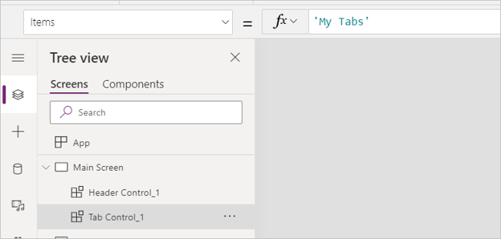

19. Change the **SelectedColor** value to `Color.WhiteSmoke`

20. Select the **Tab Control** inside the **New Report Screen** and set the Item value to `'My Tabs'`

21. Change the **SelectedColor** value to `Color.WhiteSmoke`

22. In the **Tree view**, right-click on **App** and select **Run OnStart**.

    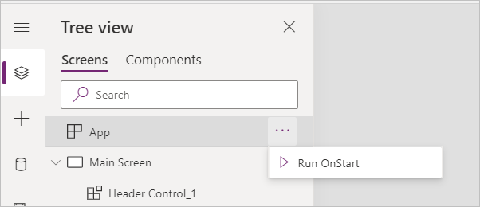

23. The tab names should update.

    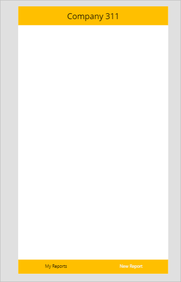

24. Select **Save** from the command bar.

    Do not navigate away from this page.


### Exercise 2: My reports

In this exercise, add a gallery that will show reports created by the current logged in user.

#### Task 1: Add gallery

1.  Select the **Main Screen**, select **Insert** menu, then select **Vertical gallery**.

2.  Rename the new gallery to `My Reports Gallery`

3.  Resize and reposition **My Reports Gallery**, setting the **Position, Y** value to `75` and the **Height** value to `1000` 

    It should look like this example:

    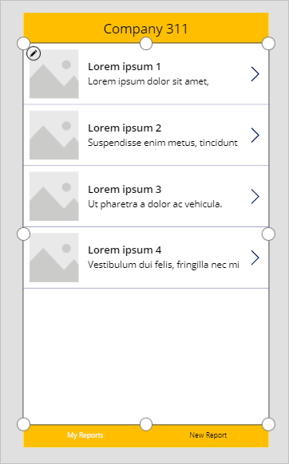

4.  Select **My Reports Gallery**, go to the **Properties** pane, and select **Problem Reports** for **Data Source**. If you do not see Problem Reports, select **See all tables** or **Search** for the table.

5.  Select the **My Reports** view you created for **View**.

6.  Under **Fields**, select **Edit**.

7.  Change Subtitle1 to **statuscode**. This is the **Status Reason** column.

8.  Select **Image** control within the gallery. Set **Image** value to the formula below. This allows images to be displayed correctly when view is used as a source.

    `LookUp('Problem Reports', 'Problem Report' = ThisItem.'Problem Report').Photo`

9.  Select the **Save** icon.

    Do not navigate away from this page.


### Exercise 3: Allow removing reports

In this exercise, allow unassigned reports to be removed. This will allow users to easily remove any reports that were accidentally created.

#### Task 1: Allow remove

1.  Expand the **My Reports Gallery**.

2.  Select the **Icon** inside the **My Reports Gallery**.

    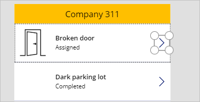

3.  In the **Tree view**, double-click **NextArrow1** and rename it to `Remove Report`

4.  Change the **Icon** value to **Icon.Trash**.

5.  Change the **Visible** value to the formula below. This formula will hide the icon if the status reason is not New.

    `If(ThisItem.'Status Reason' = 'Status Reason (Problem Reports)'.New, true, false)`

    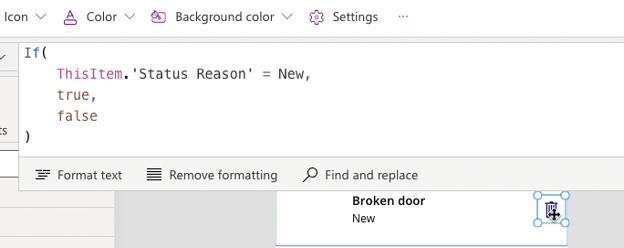

6.  Make sure you still have the **Remove Report** icon selected. Change the **OnSelect** value to the formula below. This formula will remove item from the data source.

    `Remove('Problem Reports', ThisItem)` 

7.  Change the **Tooltip** value to `"Remove this report"` 

8.  Set all the **Padding** values to `0`, this allows the icon to better fill the space in the gallery row. 

9.  Select **Save**. 


### Exercise 4: Add new report

In this exercise, add a form to the canvas app to submit new problem reports.

#### Task 1: Add new report form

1.  Select the **New Reports Screen**, select **Insert**, then select **Edit Form**.

2.  Rename the form to `New Report Form`

3.  Select **New Report Form**, go to the **Properties** pane, and select **Problem Report** for **Data source**.

4.  Select **Edit fields**.

5.  Remove the **Status Reason** Column.

6.  Remove the **Created On** Column.

7.  Select **+ Add field**.

8.  Select **Building**, **Details**, and **Photo**, and then select **Add**. 

9. Resize and reposition the form, setting the **Position, Y** value to `75` and the **Height** value to `900` 

    It takes most of the page and leave enough room for a button at the bottom.

    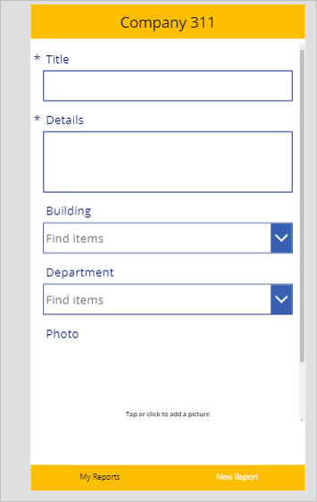

10. Select the **New Reports Screen**.

11. Select **Insert** then select **Button**.

12. Rename the button `Submit Report`

13. Move the button below the form, or set **Position, X** value to `180` and **Y** value to `990`

14. Change the **Submit Report** button **Text** property to `Submit`

15. Select the **Submit Report** button and change the **OnSelect** value to the formula below. This formula will create a new Row in the Problem Reports table.

    `SubmitForm('New Report Form') `

16. Select the **New Report Form**.

17. Change the **OnSuccess** value to the formula below. This formula will show a notification after the new Row gets created and clear the form when the record creation is successful.

    `Notify("Created new problem report row");NewForm('New Report Form')`

18. Select the **New Reports Screen**.

19. Set the **OnVisible** value to the formula below. This formula will create a new form when the screen becomes visible.

    `NewForm('New Report Form')`

20. Select **Save**.

21. Select **Publish**.

22. Select **Publish this version** and wait for the publishing to complete.

    Do not navigate away from this page.


### Exercise 5: Test the application

In this exercise, test the canvas application by submitting a problem report.

#### Task 1: Test application

1.  Select the **Main Screen** and select **Preview the app**.
    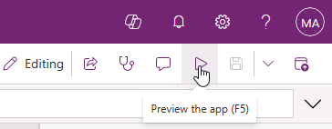

2.  The application should load, and the list should show all the reports you created.

    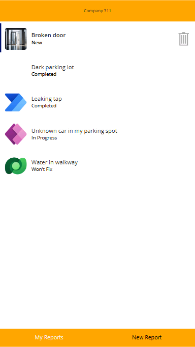

3.  Select the **New Report** tab.

4.  The **New Report Form** should load. Fill out the form and select the **Photo** Column.

5.  Select an image.

6.  Select **Submit**.

7.  The row should get created successfully and you should see the success message.

8.  Select the **My Reports** tab.

9.  You should see the new report you created. Select the **Remove Report** button to test the delete.

    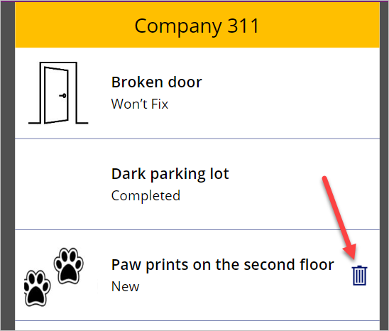

10. The row should be deleted and removed from the list.

    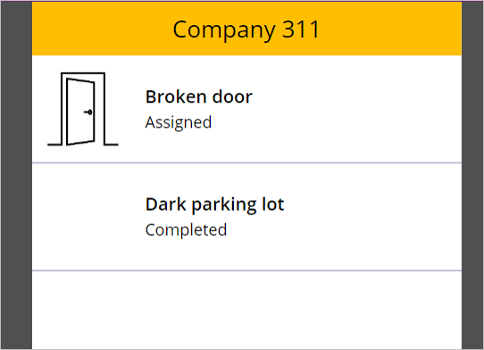 

11. **Close** the preview mode.

12. **Close** the app studio by closing the browser tab.


### Exercise 6: Explore Other ways to build Canvas applications. 

1.  Navigate to the [Power Apps maker portal](https://make.powerapps.com/) page
    and make sure you are in the correct environment.

2.  Select + **Create**.

3.  Under the **Start From** section, select **Image**.

4.  From the **Convert into an app** screen, select **Next**.

5.  Name the app **Report Problems** and set the app format to **Phone**.

6.  Select the **Choose File** button and select the **Report a Problem.png**
    file from your class resources folder, select the **Next** button.

7.  On the Draw tags and assign components screen, verify your screen matches
    the image below:

    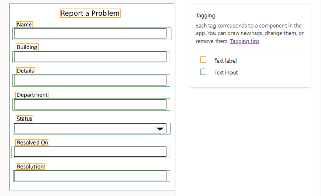 

8.  Select the **Text Input** box under the **Status** label, from the menu that
    appears, change the **Data Type** to **Drop Down.**

9.  Select the **Text Input** box under the **Resolved On** label, from the menu
    that appears, change the **Data Type** to **Date Picker.**

10. Your tagged form should resemble the image below:

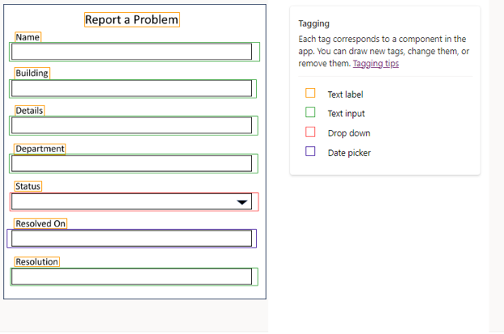

11.  Select the **Next** button.

12.  On the **Set up your Data** screen, ensure that **Connect to a Dataverse
    table is selected**, then select **Next.**

13.  On the **Select table** screen, choose **Problem Report**, then select
    **Next**. Next, we will tag the specific fields to the correct column in Dataverse.
    
    > **NOTE**
    >
    > When defining how the columns will be set up, you need to make sure that the selector includes both the **Label** and **Input** Field. Your app may not render correctly if not.

14.  Select the Tag around the Name label and the field below.

15.  Assign the item to the **Title** column, select **Save**.

16.  Using the table below, repeat the above process for each item on the form.

| Field       | Dataverse Column |
|-------------|------------------|
| Building    | Building         |
| Details     | Details          |
| Department  | Department       |
| Status      | Status Reason    |
| Resolved On | Resolved On      |
| Resolution  | Resolution       |

17.  Once complete your tagged columns should resemble the image below, select
    the **Next** button.

    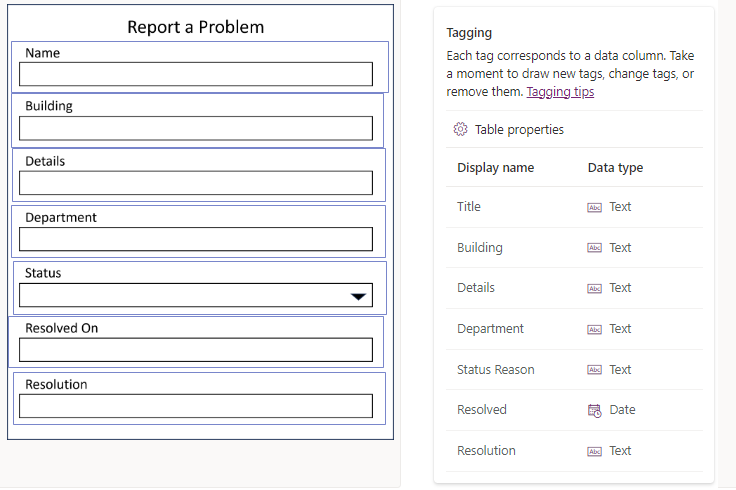

18.  On the **Review** screen, verify that your problem report resembles, the
    image below:

19.  Select **Create.**
    
    > **NOTE**
    >
    > It can take a few minutes for your new app to be created.

20.  Your newly created app will resemble the image below:

    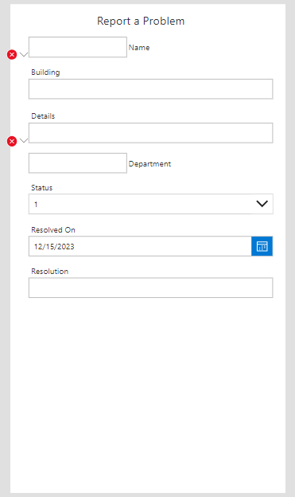

    When you create an app from an image, you are somewhat limited as to the types
    of fields that you can select. For this reason, some items such as lookup fields
    will not display properly since the data type was defined as text. For this
    reason, we will make some modifications to the application to fix this.

    Both the Department and Building field are lookup fields. We are going to remove
    the generated ones and replace them with the actual fields from Dataverse.

21.  On the left side of your app screen, select the **Form1** control.

22.  In the **Properties** section on the right of the screen, select **Edit
    Fields.**

23.  Hover the **Building_DataCardXXX (Custom)** field and **Remove** it.

24.  Hover the **Department_DataCardXXX (Custom)** field and **Remove** it as
    well.

    Next, we are going to add the actual Lookup field from Dataverse to the app.

25.  Select **Add Fields.**

26.  From the menu that appears, select the **Building** and **Department**
    fields.

    Next, we are going to make some formatting changes to ensure that all the
    Data Cards on the form look the same.

27.  Using the **Sizing controls** on **Form1**, make the form bigger so that the
    **Department** field displays.

28.  In the **Fields** menu to the left of the actual Canvas App screen, move the
    **Building** field below the **Name** field.

29.  Move the **Department** field below the **Building** field.

30. On **Form1**, Select the **Label** control on the **Details** Data Card.

31. Change the **Font** to **21** and the **Font Weight** to **Semibold**.

32. Repeat that process for the **Status**, **Resolved On** and **Resolution**
    Data Cards.

33. On **Form1** in Tree View, select the **Name_DataCardXXX (Custom)** control

34. Using the **Sizing** controls, change the **Height** of the control to about
    142.

35. Move the **Name** Data Card’s, **Textinput** control to the bottom of the
    control, and expand the controls width so that it is the same width of the
    other controls on the form.

36. Move the controls **TextLabel** to align with the other labels on the form.

37. Change the **Name Label Font** to **21** and the **Font Weight** to
    **Semibold**.

38. If necessary, resize the **Form** control to ensure that the **Resolution**
    field is completely displayed.

39. Your completed App should resemble the Image below.

    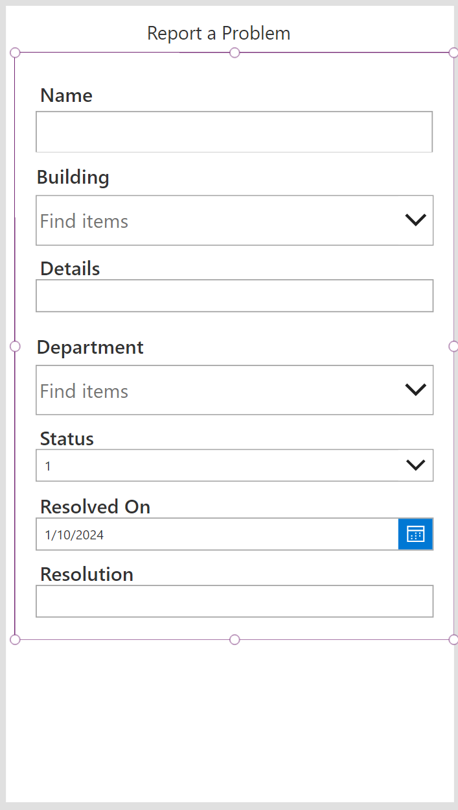
