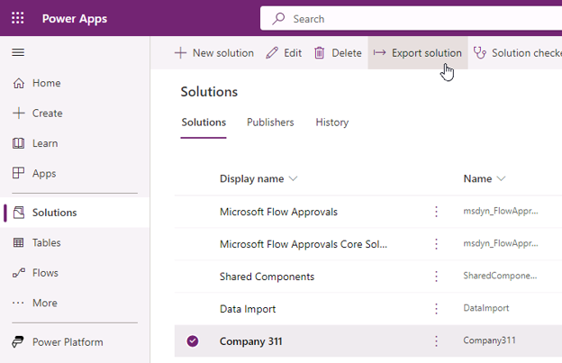
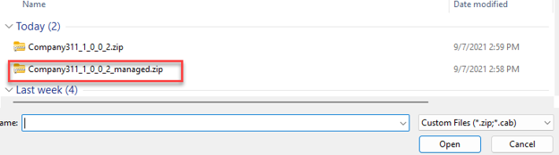
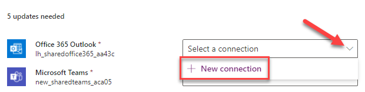
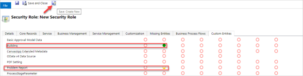

---
lab:
    title: 'Lab 06.1: Test & Deploy'
    module: 'Module 06: Testing & deployment'
---

# Lab 06: Test & Deploy

In this lab you will complete solution configuration by adding security roles for the users. Then you will verify, test, and deploy the solution in the production environment.

## What you will learn

  - How to deploy a solution to another environment

## High-level lab steps

-   Exercise 1 – Export and import solution

-   Exercise 2 – Create security roles for users

    -   Company 311 User – read all on Building, user owned on Problem Reports

    -   Company 311 Admin – All access for Buildings, Departments, Problem
        Reports

    -   Associate Company 311 Admin role with model-driven app

## Prerequisites

Must have completed the following labs:

-   02.1: Data model

-   02.2: Work with forms and views

-   02.3: Compose a model-driven app

-   02.4: Import data

## Detailed steps

### Exercise 1: Import export

In this exercise, you will export the company 311 solution and import it into a new environment.

#### Task 1: Export solution

1.  Navigate to the [Power Apps maker portal](https://make.powerapps.com/) and make sure you are in the correct environment.

2.  Select **Solutions**, and open the **Company 311** solution.

3.  Select **+ Add existing**, select **More**, then select **Connection Reference**.

    

4.  Select all of the connection references and select **Add**.

5.  Select **Publish all customizations** and wait for the publishing to complete.

6.  Navigate back to the **Solutions** list. 

7.  Select the **Company 311** solution and select **Export Solution** from the toolbar.

     

8.  Select **Next**.

8.  Select **Managed** and select **Export**. Wait for the solution to be packaged and exported.

9.  When it has exported successfully, select **Download** to save the solution to your computer. 

10. Select **Export solution** again. 

11. Select **Next**. 

12. Select **Unmanaged**, change the **version** to match the managed solution version and select **Export**. 

13. You should have the **Managed** and **Unmanaged** versions of the solution exported and downloaded.

#### Task 2: Create new environment and import solution

1.  Navigate to [https://powerapps.microsoft.com/communityplan/](https://powerapps.microsoft.com/communityplan/)

2.  Select **Existing User? Add a dev environment**. 

3.  Enter your credentials when prompted to sign in.

4.  Select your country from the dropdown menu and select **Accept**.

5.  Navigate to [Power Platform Admin Center](https://admin.powerplatform.microsoft.com/environments) to see a new environment had been created by the system. We will refer to it as the "Prod" environment for the rest of this lab (the environment name will be <your account name>'s Environment).

6.  Navigate to the [Power Apps maker portal](https://make.powerapps.com/) and select the environment you just created.

7.  Select **Solutions** and select **Import solution**.

8.  Select **Browse**.

9.  Select the managed solution you exported and select **Open**.

    

10. Select **Next**. 

11. Select **Next** again. 

12. Select **Select connection** for outlook and then select **+ New connection**.

    

13. It will open a new window. Select **Create**.

14. Provide your **credentials**.

15. Close the connections browser window or tab.

16. Select **Refresh**.

17. Repeat steps 12 - 16 for the rest of the of the connections.

18. Select **Import** and wait for the import to complete.

19. Select **Publish all customizations** and wait for the publishing to complete.

20. Open the **Company 311** solution you just imported.

21. Review the components in solution.

22. Select **Apps** and make sure you have both the Canvas and Model-driven apps.

23. Open the **Company 311 Admin** application.

24. The application should load without issues.

25. Close the Company 311 Admin application browser window or tab.

26. Open the **Company 311 Phone** application.

27. The application should load without issues.

28. Close the **Company 311 Phone App** browser window or tab.

### Exercise 2: Create security roles

In this exercise, you will create security roles for users.

#### Task 1: Create security roles

1.  Navigate to the [Power Apps maker portal](https://make.powerapps.com/) and
    make sure you are in the correct environment.

2.  Select **Solutions** and open the **Company 311** solution.

3.  Select **+ New \> Security** and select **Security Role**.

4.  Enter **Company 311 User** for **Role Name** and select the **Custom
    Entities** tab.

5.  Set the read privilege of the **Building** table to **Organization**.

6.  Set the read privilege of the **Problem Report** table to **User**.

7.  The read privileges for the **Building** and **Problem Report** Tables
    should now look like the image below. Select **Save Create New**.

    

8.  Enter **Company 311 Admin** for **Role Name** and select the **Custom
    Entities** tab.

9.  Set all privileges of the **Building**, **Department**, and **Problem
    Reports** tables to **Organization**.

    

10. Select the **Customization** tab.

11. Set all privileges for **Model-driven app**.

    

12. Select **Save and Close**.

13. Select **Done** on the pop-up.

14. Select **All** from the **Objects** pane.

15. Select **Publish all customizations** and wait for the publishing to
    complete.
