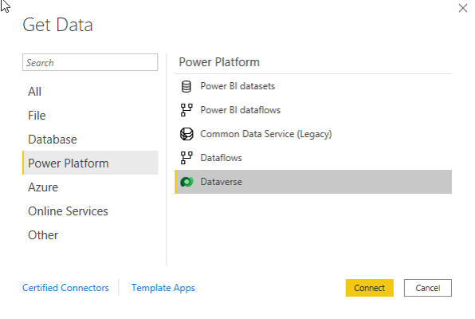
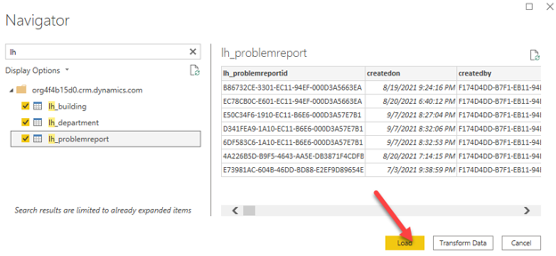
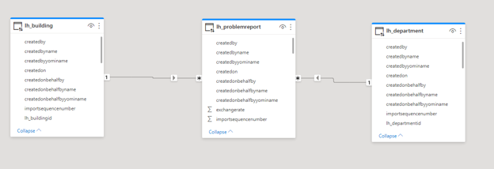
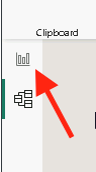
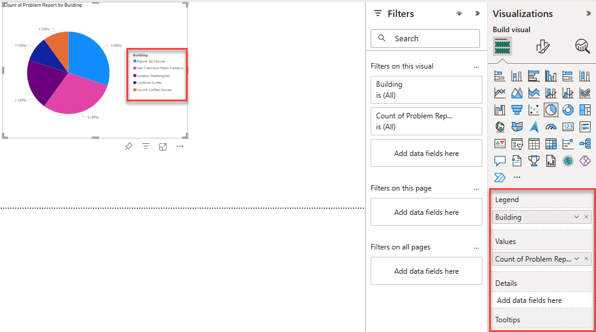
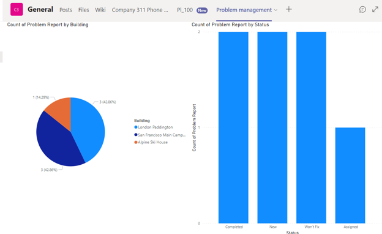
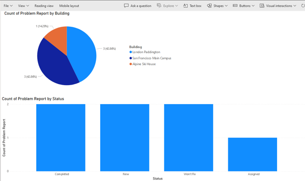

---
lab:
    title: 'Lab 07.1: Build Power BI dashboards'
    module: 'Module 07: Create and use analytics in Power BI'
---

# Lab 07.1: Build Power BI dashboards

In this lab, you will build a Power BI dashboard that visualizes data about problems reported by company employees.

## What you will learn

  - How to connect to Dataverse 
  - How to refine the data model and prepare it for reporting
  - How to create a Power BI visualization 
  - How to embed a Power BI report in Microsoft Teams

## High-level lab steps

We will follow the below steps to design and create the Power BI dashboard:

-   Connect to tables in Microsoft Dataverse 
-   Transform the data to include user-friendly descriptions for the related rows (lookups)
-   Create and publish a report with various visualizations of the information about problem reports
-   User natural language query to build additional visualizations
-   Build mobile view
-   Embed the Company 311 Power BI report to Microsoft Teams

## Prerequisites

* Must have completed Lab 02.1: Data model
* Permissions to install programs on your computer (required for Power BI Desktop installation)

## Things to consider before you begin

-   Who is the target audience of the report?
-   How will the audience consume the report? Typical device? Location?
-   Do you have sufficient data to visualize?
-   What are the possible characteristics you can use to analyze data about the visits?

## Detailed steps

### Exercise 1: Create a workspace

In this exercise, you will create a Power BI report based on data from Microsoft Dataverse tables.

#### Task 1: Create a new workspace

Before you Begin, download the [problem-reports-data.pbix](https://github.com/MicrosoftLearning/PL-100-Microsoft-Power-Platform-App-Maker/blob/master/Instructions/Labs/05%5CResources%5Cproblem-reports-data.pbix) file and save it to your computer.

1.  Navigate to [Power BI](https://app.powerbi.com)

2.  On the left side of your screen, select Workspaces.

3.  Choose **New Workspace**.

4.  Name the Workspace `311 Workspace`.

5.  Select Apply.

6.  Select **Upload**.

7.  From the menu that appears, select **Browse**.     

8.  Locate and select **problem-report-data.pbix** file that you've downloaded earlier.

9.  Once data load is complete, select **problem-reports-data** report.

#### Task 2: Prepare Data

1.  Open Power BI if it is not already open.

2.  Select **Get data** > **Dataverse**.

3.  Select **Sign in**.

    

4.  The connection details dialog will open up. If you are not signed in, select **Sign in** and follow the prompts to sign in. Select **Connect**. 

5.  Expand environment node. Using `lh_` to filter, select the **lh_building**, **lh_department**, **lh_problemreport** tables and select **Load**. Wait until the load is complete.

     

6.  On the **Connection settings** window, choose **DirectQuery** and select **OK**.

7.  Select the **Model** icon on the left vertical toolbar.

8.  Power BI should detect the relationships between the tables. The relationship should look like the image below.

    

9. Select the **Report** icon on the left side of the canvas.

10. Expand the **lh_problemreport** node in the **Data** panel. 

11. Select the **...** More options button of the **lh_ProblemReport** table. 

12. Select **New column**. 

13. Complete the formula as below and press ENTER or select the checkmark button. That will add a new column with the building name into the problem report data.

    ```Building = RELATED(lh_Building[lh_name])```

14. Repeat the three previous steps on **lh_problemreport** node to add a column **Department** with the below formula.

    ```Department = RELATED(lh_Department[lh_name])```

15. Select the **...** menu next to the **lh_problemreportid** column of the **lh_problemreport** table and select **Rename**. Enter `Problem Report` as the column name.

16. Select the **...** menu next to the **statuscodename** column and select **Rename**. Enter `Status` as the column name.

17. Save work in progress by selecting **File** > **Save** and enter `Problem management` as a filename.


### Exercise 2: Create Power BI Report 

In this exercise, you will create a Power BI report based on data from Microsoft Dataverse tables.

#### Task 1: Create Chart and Time Visualizations

1.  Click on **Report view**

    

2.  Select the **Pie chart** icon in the **Visualizations** panel to insert the chart.

3.  Expand **lh_ProblemReport** table in the **Data** panel, drag **Building** Column and drop it into **Legend** target box.

4.  Drag **Problem Report** Column and drop it into **Values** target box.

5.  Resize the pie chart using corner handles so that all chart components are visible. Your report should now look like this:

    

6.  Select the report's design surface outside of the chart area. Select **New visual** on the Power BI ribbon then select **stacked column** chart in **Visualizations** pane. 

7.  Drag **Problem Report** Column and drop it into **Y-axis** target box.

8.  Drag **Status** Column and drop it into **X-axis** target box.

9.  **Resize** the chart as required using the corner handles.

10.  **Test** the report interactivity:

    * Select various building slices on the pie chart and observe changes on the stacked column chart.
    * Select various bars on the stacked column chart and observe changes on the pie report.

11. Select the **Insert**, and select **Q&A**.

12. Select **Turn on Q&A** and wait for the Q&A to get ready.

13. Enter `bar count of problem reports by building`. You should now have a bar chart.

14. The dashboard now has Q&A enabled. Select the **...** More options button of the Q&A visual and select **Remove**.

15. Save work in progress by selecting **File | Save**.


### Exercise 3: Create Power BI Dashboard

#### Task 1: Publish Power BI Report

1.  Navigate to [Power BI Service](https://app.powerbi.com)

2.  Select **Workspaces** and select **Create a workspace**.

3.  Enter **311 Workspace** for Workspace name and select **Save**.

4.  Go back to the Power BI desktop application, select the **Home** tab, and select **Publish**.

5.  Select **311 Workspace** as the destination.

6.  **Wait** until publishing is complete and open the **<name of your report\>.pbix** file in Power BI.

    This will open the published report in the browser.

> **NOTE**
>
> If you are getting an error on PowerBI Service with message "the data source is missing credentials and cannot be accessed", follow the below steps:
>
> 1. Select **311 Workspace** and select the **Problem Management** dataset.
> 2. Expand Refresh dropdown and select **Schedule refresh**.
> 3. Expand **Data Source credentials** section and select **Edit Credentials**.
> 4. Select **OAuth2** for **Authentication** Method and **Organizational** for **Privacy level setting**.
> 5. Select **Sign in**. This will resolve the issue for report and it should display properly on Power BI.


#### Task 2: Create Power BI Dashboard

1.  Click on **311 Workspace**. If it is not in your menu, select **Workspaces** and then **311 Workspace**

2.  Select the **Problem management** with a type **Report**. 

3.  Select **Pin to a dashboard** on the menu. Depending on the layout you may need to press **...** to show additional menu items.

4.  Select **New dashboard** on **Pin to dashboard** prompt.

5.  Enter **Problem Management Dashboard** as a **Dashboard name**, select **Pin live**.

6.  Select **311 Workspace** node, select **Problem Management Dashboard**.

7.  Test interactivity of the pie and bar charts that are displayed.


#### Task 3: Add Visualizations Using Natural Language

1.  Select **Ask a question about your data** on top of the dashboard.

2.  Enter **funnel count of problem reports by status** in Q&A area. The funnel chart will be displayed.

3.  Select **Pin visual**.

4.  Select **Existing dashboard**, select **Problem Management dashboard**, select **Pin**.


#### Task 4: Build Mobile Phone View

1.  Select the **Problem Management dashboard** from **Dashboards** area.

2.  Select **Edit** and then select **Mobile Layout** from the drop-down box.

3.  **Rearrange** the tiles as desired.

4.  Select your report under **311 Workspace**. Make sure you select **Problem management** with type **Report**.

5.  Select **File** and then select **Generate QR Code** from the drop down box.

6.  If you have a mobile device, scan the code using a QR scanner app available on both iOS and Android platforms.

    > **NOTE**
    >
    > To access the dashboard and report, you will have to sign in on the phone as the same user.

7.  Navigate and explore reports and dashboards on a mobile device. 


### Exercise 4: Embed Power BI report

In this exercise, you will add the Company 311 Power BI report to Microsoft Teams and to the Company 311 Admin Model-driven application as a way for management and staff to be able to view the reports from directly within Teams and the Model-driven application. 

#### Task 1: Setup Company 311 Team

In this task you will setup a Microsoft Teams team for the Lamna Healthcare Company, if you have not done so previously.

1.  Navigate to [Microsoft Teams](https://teams.microsoft.com) and sign in with the credentials you have been using previously.

2.  Select **Use the web app instead** on the welcome screen.

    

3.  When the Microsoft Teams window opens, dismiss the welcome messages.

4.  On the bottom left corner, choose **Join or create a team**.

5.  Select **Create a team**.

6.  Press **From scratch**.

7.  Select **Public**.

8.  For the Team name choose **Company 311** and select **Create**.

9.  Select **Skip** adding members to Company 311.


#### Task 2: Embed Power BI report to Teams

1.  Navigate to [Microsoft Teams](https://teams.microsoft.com).

2.  Select the **General** channel of the **Company 311** team.

3.  On the top of the page, press the **+** symbol to add a new tab.

4.  Search for and select **Power BI** from the results.

5.  Expand the **311 Workspace** and select the report you created earlier in this lab, then select **Save**.

6.  You should now have your Power BI report in a tab in Microsoft Teams.

    

#### Task 3: Embed Power BI report to Model-driven app

1.  Navigate to [Power BI](https://app.powerbi.com/home).

2.  Select **Data hub**.

3.  Hover over the dataset you created, select the **...** More options button, and select **Settings**.

4.  Select **Edit credentials**, located in the **Data source credentials** section.

5.  Select **OAuth2** for Authentication method, select **Organizational** for Privacy level setting, and select **Sign in**.

6.  Provide your credentials.

7.  Navigate to [Power Apps maker portal](https://make.powerapps.com/) and make sure you are in your practice environment.

8.  Select **Solutions** and open the **Company 311** solution.

9.  Select **+ New** and select **Dashboard | Power BI embedded**.

10. Enter `Problem management` for **Display name**, select **Power BI report** for type, uncheck **Show reports in this environment only** and select **311 Workspace** for **Power BI workspace**, select **Problem management** for **Power BI report** and select **Save**.

11.  Select **Publish all customizations** and wait for the publishing to complete.

12.  While still in the Company 311 solution, open the **Company 311 Admin** Model-driven application.

13. In app designer, make sure you have **Manage Problems** area selected. If not, click on the arrows and select **Manage Problems**.

14. Select the ellipses next to **Navigation** title and select **New group**.

15. Go to the **Properties** pane and enter **Reports** for **Title**.

16. Select the **Reports** group you just created, select **+ New**.

17. Select **Dashboard** for Type and click **Next**. 

18. **Under Power BI dashboards** check the checkmark next to **Problem management** and then select **Add**.

19. Select the **...** ellipsis icon next to the **Reports** group and select **Move up**. 

20. Select **Save**, then select **Publish**, wait for the publishing to complete and then select **Play**. 

21. The report should load.

22. Interact with the report and make sure it behaves as expected.


### Exercise 5: Power BI embedded canvas app

In this exercise, you will add a canvas application to Power BI as a visual.

#### Task 1: Add canvas

1.  Navigate to [Power BI](https://app.powerbi.com).

2.  Select **Workspaces** and then select to open **311 Workspace**.

3.  Open the **Problem management** report.

4.  Select **Edit**.

5.  **Resize** and **reposition** the visuals as shown below.

    

6.  Select an empty area of the canvas, go to the **Visualizations** pane and select **Power Apps for Power BI**.

7.  Select the Power BI visual you just created, expand the **lh_problemreport** table select **Problem Report** column. Drag the **Problem Report** column into the **Add data fields here** can be tracked under the **Visualizations >> PowerApps Data**

8.  Select your practice environment and select **Create new**.

9.  A **new browser tab** should open and load the **Power Apps Studio**.

10. Do not navigate away from this page.


#### Task 2: Customize the app

1.  Right-click on the **Gallery** and select **Delete**.

2.  Select **Settings** from the toolbar. 

3.  Select the **Display** tab.

4.  Change the **Orientation** to **Landscape** and select **Apply** on the popup. 

5.  Close the **Settings** window. 

6.  Select **Data** and select **Add data**.

7.  Select the **Problem reports** table.

8.  From the **Tree view**, select the **App** object.

9.  Select the **OnStart** property of the **App** object (found in the **Advanced** tab) and set it to the formula below. This formula will create two variables one to keep track of the current index of the reports table and another to keep track of the current item row.

    ```Set(currentIndex,1);Set(CurrentItem, LookUp('Problem Reports', 'Problem Report' = GUID(Last(FirstN([@PowerBIIntegration].Data,currentIndex)).'Problem Report'))) ```

10. Select the **+ Insert** button, expand **Media** group, then select **Image**.

11. Set the **Image** value to the formula below.

    ```CurrentItem.Photo```

12. Select the **...** menu button of the **App** object and select **Run OnStart**.

13. The photo from the Problem Report should load. If you are not seeing the photo, then go to the Admin **Model-driven App** and add photo to any Problem Report records where the **Photo** field is **empty**. 

14. Set the **X** value of the image to **0**.

15. Set the **Y** value of the image to **0**.

16. Set the **Width** value of the image to the formula below.

    ```Parent.Width```

17. Set the **Height** value of the image to the formula below.

    ```Parent.Height```

18. The image should fill the screen.

19. Do not navigate away from this page.


#### Task 3: Add controls

1.  Select the **Insert** tab and select **Text label**.

2.  Select **Label1** from the tree view and set the **Text** value to the formula below.

    ```CurrentItem.Title```

3.  Set the **Height** value of the label to **60**.

4.  Set the **X** value of the label to **0**.

5.  Set the **Y** value of the label to formula below.

    ```Parent.Height - Self.Height```

6.  Set the the **Width** value of the label to formula below.

    ```Parent.Width```

7.  Set the **Fill** value of the label to `RGBA(0, 108, 191, .5).`

8.  Set the **Color** value of the label to `RGBA(255, 255, 255, 1)`.

9.  Set the **Align** value to the formula below.

    ```Align.Center```

10. If you don't see the title, select the **...** button of the **App** object and select **Run OnStart** again.

11. Select **+ Insert**, enter **next** in the search box, then select **Next arrow** under **Icons**.

12. Double-click on the name of the icon you just added and rename it **Next icon**.

13. Select **+ Insert**, enter **back** in the search box, then select **Back arrow** under **Icons**.

14. Double-click on the name of second icon you just added and rename it **Back icon**.

15. Drag and place the **Next icon** above the right side of the label.

16. Drag and place the **Back icon** above the left side of the label.

17. The icons should now look like the image below.

    

18.  Select the **Next icon** and set the **OnSelect** value to the formula below.

    ```UpdateContext({CurrentItem: LookUp('Problem Reports', 'Problem Report' = GUID(Last(FirstN([@PowerBIIntegration].Data,currentIndex+1)).'Problem Report'))});UpdateContext({currentIndex: currentIndex+1})```

19.  Set the **DisplayMode** value of the **Next icon** to the formula below.

    ```If(currentIndex = CountRows([@PowerBIIntegration].Data), DisplayMode.Disabled, DisplayMode.Edit)```

20. Select the **Back icon** and set the **OnSelect** value to the formula below.

    ```UpdateContext({CurrentItem: LookUp('Problem Reports', 'Problem Report' = GUID(Last(FirstN([@PowerBIIntegration].Data,currentIndex-1)).'Problem Report'))});UpdateContext({currentIndex: currentIndex-1})```

21. Set the **DisplayMode** value of the **Back icon** to the formula below.

    ```If(currentIndex > 1, DisplayMode.Edit, DisplayMode.Disabled)```

22. Select **+ Insert**, enter **check** in the search box, then select **Check** under **Icons**.

23. In the tree view, double-click **Icon1** and rename the Check icon to **Complete icon**. 

24. Move the **Complete icon** to the top right of the screen.

25. Set the OnSelect of the **Check icon** to the formula below. This formula will update the status of the row to completed and then refresh Power BI.

    ```Patch('Problem Reports', CurrentItem, {'Status Reason': 'Status Reason (Problem Reports)'.Completed}); PowerBIIntegration.Refresh()```

26. Select **Play**.

27. Select the **next** and **back** icons and make sure the image changes.

28. **Close** the preview.

29. Select the **Save** button.

30. Enter **Power BI embed app** for **Name**.

31. Select **Save**.

32. Select the **Publish** button. Select **Publish this version**.

33. **Close** the app studio browser window or tab.

34. You should now be back on the Power BI report. Select **Refresh** on the top header. 

35. Select the **Next** and **Back** icons to make sure the application loads the images.

36. Select the **Completed** column of the stacked column chart and make a note how many rows are completed.

37. Select any column of the stacked column chart apart from **Completed**. Select the **next** icon to see the next image.

38. Select the **Complete** icon.

39. The completed count should increase. If the completed count doesn't increase, select refresh and wait for the visuals to be refreshed.

40. **Save** the report.


## Challenges

* Dashboards and reports to include drilldown to individual reports with photos.

* Report and analyze problem patterns and trends.

* Problem resolution status visualization as a funnel.


## Addendum

### Import sample data

In this exercise, you will import sample data into Power BI service. That allows you to complete the lab exercises even if do not have required permissions to install desktop applications, or experience difficulties in configuring Power BI Desktop and connecting it to the data. After completion of this exercise you can skip **Exercise1** and start the lab on **Exercise 2** using Power BI service ([https://app.powerbi.com](https://app.powerbi.com)) instead of Power BI Desktop. 

1.  Download [problem-reports-data.pbix](05\Resources\problem-reports-data.pbix) and save on your computer.

2.  Navigate to [Power BI](https://app.powerbi.com/).

3.  Select **311 Workspace**.

4.  Expand **+New** and select **Upload a file**.

    

5.  Select **Local File**.

6.  Locate and select **problem-report-data.pbix** file that you've downloaded earlier.

7.  Once data load is complete, select **problem-reports-data** report.

8.  Select **...** then select **Edit**.

    

9. You can now start **Exercise 2: Create Power BI Report** of this lab.

    > **NOTE**
    >
    > The sample data contained in **pbix** file may differ from the data present in the Dataverse instance. If reports are built using imported file, some of the visual elements and functionality may vary as a result.
